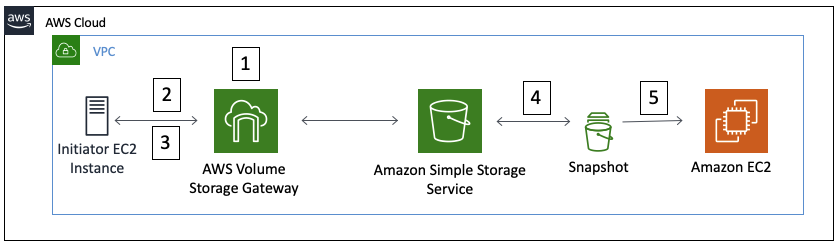

# Deploy and Monitor AWS Volume Storage Gateway

© 2020 Amazon Web Services, Inc. and its affiliates. All rights reserved.
This sample code is made available under the MIT-0 license. See the LICENSE file.

Errors or corrections? Contact [ttasker@amazon.co.uk](mailto:ttasker@amazon.co.uk).

---
# Short workshop summary

In the safety and comfort of AWS you will deploy AWS Volume Storage Gateway, create and attach an iSCSI volume to a server, take a snapshot of the AWS Storage Gateway volume and then attach directly to the server using EBS. With added performance testing and analysis.  

## What is the AWS Storage Gateway?

AWS Storage Gateway is a hybrid cloud storage service that gives you on-premises access to virtually unlimited cloud storage. Customers use the AWS Storage Gateway to simplify storage management and reduce costs for key hybrid cloud storage use cases. These include moving tape backups to the cloud, reducing on-premises storage with cloud-backed file shares, providing low latency access to data in AWS for on-premises applications, as well as various migration, archiving, processing, and disaster recovery use cases.   

You can configure the AWS Storage Gateway service as an AWS Volume Storage Gateway to present cloud-based iSCSI block storage volumes to your on-premises applications. The AWS Volume Storage Gateway provides either a local cache or full volumes on-premises while also storing full copies of your volumes in the AWS cloud. AWS Volume Storage Gateway also provides Amazon EBS Snapshots of your data for backup, disaster recovery, and migration.

## Topics covered in the workshop

In this workshop we will be looking at how to:

1. Deploy an AWS Volume Storage Gateway on Amazon EC2 with iSCSI volumes.
2. Attach the iSCSI volumes to an Amazon Linux EC2 Instance.
3. Use Flexible IO Tester (FIO) to generate performance data on AWS Volume Storage Gateway.
4. Take a snapshot of an iSCSI volume attached to the AWS Volume Storage Gateway.
5. Mount the snapshot to an alternative Amazon Linux EC2 Instance.  

The image below represents the high level architecture that we will be deployed during the workshop.  

In our workshop the initiator will  be labelled throughout as the **EC2 Initiator Instance**.  The target will be the **AWS Volume Storage Gateway**.   

**Note:** we will be using the Amazon EC2 service to host both the initiator (**EC2 Initiator Instance**) and the target (**AWS Volume Storage Gateway**) in this workshop. Saves you having to find a data centre.  

## Workshop prerequisites

#### AWS Account

In order to complete this workshop, you will need an AWS account with rights to create AWS IAM roles, EC2 instances, Storage Gateway service, Amazon S3, and CloudFormation stacks in the AWS regions you select.

#### Software

- **Internet Browser**  – It is recommended that you use the latest version of Chrome or Firefox for this workshop.

## Cost

**Important Note**: For the purposes of performance testing and analysis, the workshop will use high performance EC2 instances and io1 EBS volumes for a short period of time.  

It will cost approximately **150 USD** to run this workshop for a day (24hrs), **~7 USD** an hour.  It is recommended that you follow the cleanup instructions once you have completed the workshop to remove all deployed resources and limit ongoing costs to your AWS account.

## Related workshops

- [NFS server migration using AWS DataSync and AWS Storage Gateway](https://github.com/aws-samples/aws-datasync-migration-workshop/tree/master/workshops/nfs-migration/EN)
- [Access data in Amazon S3 using AWS Transfer Family and AWS Storage Gateway](https://github.com/aws-samples/aws-transfer-storage-gateway-workshop)

## Workshop modules

This workshop consists of the following modules:

- **Module 1** - Deploy EC2 Initiator Instance resources
- **Module 2** - Deploy AWS Volume Storage Gateway
- **Module 3** - Storage Performance Testing with FIO
- **Module 4** - Snapshot the volume and create an EBS volumes
- **Module 5** - Cleanup

If you're ready to start let's move straight on to **Module 1** and may your CHAP authentication work first time.  

To get started, go to [Module 1](/module1).
