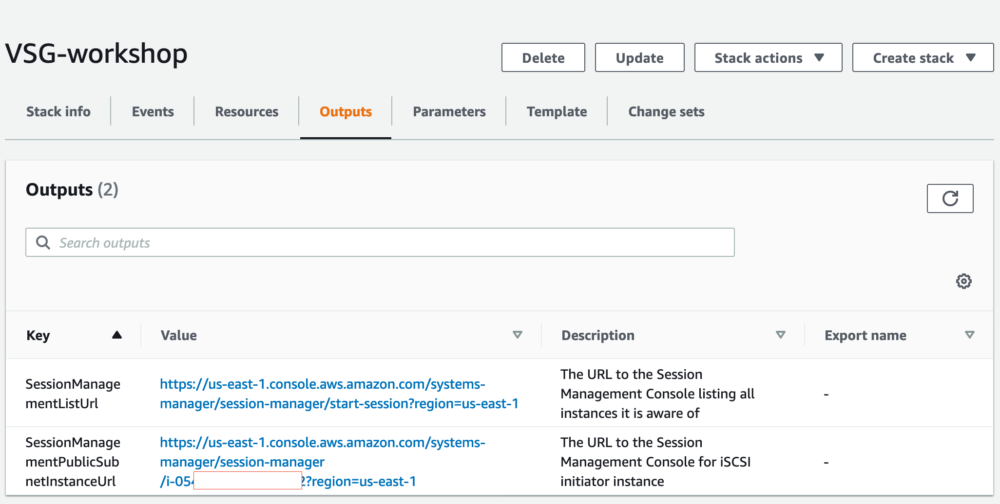

### Deploy and Monitor AWS Volume Storage Gateway

© 2020 Amazon Web Services, Inc. and its affiliates. All rights reserved.
This sample code is made available under the MIT-0 license. See the LICENSE file.

Errors or corrections? Contact [ttasker@amazon.co.uk](mailto:ttasker@amazon.co.uk).

---

# Module 1

## Deploy Resources

In this module you will use AWS CloudFormation to deploy the resources needed for the workshop into in a single region. The CloudFormation template will create the following resources:
1.	A public subnet with an internet gateway.
2.	The EC2 Initiator Instance with a no ingress security group.
3.	SSM Session Manager roles to connect to the EC2 Initiator Instance.
4.	A Security Group for the AWS Volume Storage Gateway with the following parameters:

  a.	Ingress on (HTTP) port 80 from 0.0.0.0/0 to perform activation.  In real a world scenario this should be limited to the machine that will perform the activation.

  b.	Ingress on (iSCSI) port 3260 from 10.0.0.0/16 assumed to be the public subnet range.

You will then connect to the EC2 Initiator Instance and install iSCSI utilities and FIO for load testing.

## Module Steps

#### 1. Deploy AWS resources

1. Click one of the launch links in the table below to deploy workshop resources using CloudFormation.  To avoid errors during deployment, select a region in which you have previously created AWS resources.

  | **Region Code** | **Region Name** | **Launch** |
  | --- | --- | --- |
  | us-west-2 | US West (Oregon) | [Launch in us-west-2](https://console.aws.amazon.com/cloudformation/home?region=us-west-2#/stacks/new?stackName=VolumeStorageGatewayWorkshop&templateURL=https://aws-storage-gateway-samples-01.s3-eu-west-1.amazonaws.com/volume-storage-gateway-workshop.yaml) |
  | us-east-1 | US East (N. Virginia) | [Launch in us-east-1](https://console.aws.amazon.com/cloudformation/home?region=us-east-1#/stacks/new?stackName=VolumeStorageGatewayWorkshop&templateURL=https://aws-storage-gateway-samples-01.s3-eu-west-1.amazonaws.com/volume-storage-gateway-workshop.yaml) |
  | eu-west-1 | Ireland | [Launch in eu-west-1](https://console.aws.amazon.com/cloudformation/home?region=eu-west-1#/stacks/new?stackName=VolumeStorageGatewayWorkshop&templateURL=https://aws-storage-gateway-samples-01.s3-eu-west-1.amazonaws.com/volume-storage-gateway-workshop.yaml) |
  | eu-central-1 | Frankfurt | [Launch in eu-central-1](https://console.aws.amazon.com/cloudformation/home?region=eu-central-1#/stacks/new?stackName=VolumeStorageGatewayWorkshop&templateURL=https://aws-storage-gateway-samples-01.s3-eu-west-1.amazonaws.com/volume-storage-gateway-workshop.yaml) |
| ap-northeast-1 | Tokyo | [Launch in ap-northeast-1](https://console.aws.amazon.com/cloudformation/home?region=ap-northeast-1#/stacks/new?stackName=VolumeStorageGatewayWorkshop&templateURL=https://aws-storage-gateway-samples-01.s3-eu-west-1.amazonaws.com/volume-storage-gateway-workshop.yaml) |

2. Click **Next** on the **Create Stack** page.
3. Enter a new **Stack Name** if needed, and click **Next**.
4. Click **Next** again. (skipping the Configure stack options and Advanced options sections)
5. On the Review page, scroll to the bottom and check the box to acknowledge that CloudFormation will create IAM resources, then click  **Create stack**.

Wait for the CloudFormation stack to reach the **CREATE\_COMPLETE** state before proceeding to the next steps.  It should take about 5 minutes for the CloudFormation stack to complete. You can refresh the Events section to see the progress.  

**NOTE:** If a stack fails to deploy because an EC2 Instance type is not available in a particular availability zone, delete the stack and retry in the same region or in a different region.

#### 2. Stack Outputs

Upon completion, each CloudFormation stack will have a list of **Outputs**. This will contain the link you can use to connect via SSM Session Manager to the iSCSI EC2 Initiator Instance. You can either copy these values elsewhere or keep the page open in your browser and refer to them as you go through the workshop.

#### 3. Connect to EC2 Initiator Instance

1.	Either **click on the URL for the Session Manger** from the previous CloudFormation Outputs **or**
  1.	From the AWS console, click **Services** and select **EC2**.
  2.	Select **Instances** from the menu on the left.
  3.	Right-click on the **EC2 Initiator Instance** and select **Connect** from the menu.
  4.	From the dialog box, select the **Session Manager** option, as shown below:
  5.	Click **Connect**. A new tab will be opened in your browser with a command line interface (CLI) to the Application server.
2.	Run the following commands on the EC2 Initiator Instance:

    sudo yum update -y

    sudo yum install iscsi-initiator-utils -y

    sudo yum install fio -y

    mkdir /home/ssm-user/fio

    cat /etc/iscsi/initiatorname.iscsi

Make a not of the output from "**cat /etc/iscsi/initiatorname.iscsi**".  This will be needed in **Module 2**.

## Module Summary

In this module you deployed the EC2 Initiator Instance, installed iSCSI utilities and installed FIO which will be used to perform load testing on the iSCSI volume.

In the next module, you will create the Volume Storage Gateway and connect the volume to the EC2 Initiator Instance.

Go to [Module 2](/module2).
