### Workshop Title

© 2020 Amazon Web Services, Inc. and its affiliates. All rights reserved.
This sample code is made available under the MIT-0 license. See the LICENSE file.

Errors or corrections? Contact [ttasker@amazon.co.uk](mailto:ttasker@amazon.co.uk).

---

# Module 2
In this module you will use the AWS console to deploy an AWS Volume Storage Gateway EC2 instance.  You will then create a cached volume and mount it to the EC2 Initiator Instance.  
## Module Steps

#### 1. Check the VPC ID of the EC2 Initiator Instance

1.	From the **AWS console**, click **Services** and select **EC2**.
2.	Select **Instances** from the menu on the left.
3.	Click on the **EC2 Initiator Instance**.
4.	In the bottom panel scroll down till you see the **VPC ID**  *eg vpc-07a29732eabd36cd6* and note this down.

#### 2. Deploy Volume Storage Gateway

1.	From the **AWS console**, click **Services**, under **Storage** select **Storage Gateway**.
2.	A new page will appear click **Get Started**.
3.	Select **Volume Gateway -> Cached Volumes** and click next.

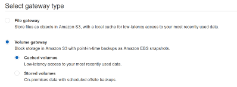

4.	Under **Select host platform** choose **Amazon EC2** and then **Launch Instance**.

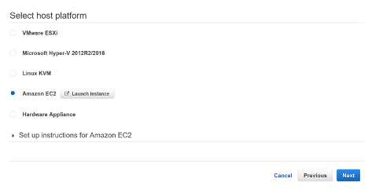

5.	A new tab will open. Select the instance **m5n.xlarge** type and then click **Next: Configure Instance Details**.

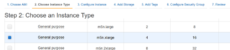

6.	Under **Network** select the VPC you noted down in the previous section it should be the non-default VPC and then click **Next: Add Storage**

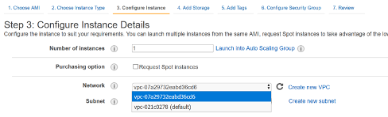

7.	Click **Add New Volume** *twice* and enter the following details for each new disk:
  * Volume Type **EBS**
  * Size **200GiB**
  * Volume type **Provisioned IOPS SSD (io1)**
  * IOPS **10000**
  * **Delete on Termination** ticked

You should now have a total of **3 volumes**.

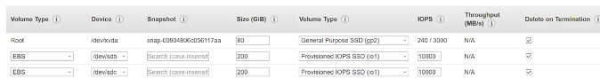

8.	Click **Next: Add Tags**.
9.  Add tags as needed.
10.	Click **Next: Configure Security Group**.
11.	Choose **Select an Existing Security Group**  and choose **StorageGatewaySecurityGroup**.
12.	Click **Review and Launch**.
13.	A warning may pop up around port 22 not being open click **Continue**.
14.	Click **Launch**.
15.	Choose **Proceed without a key pair** and **check the box** (I acknowledge that I will not be able to connect to this instance unless I already know the password built into this AMI.), and then click **Launch Instances**.

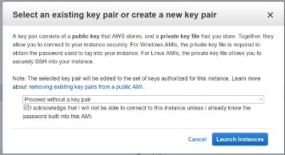

16.	Click **View Instances**.
17.	Click on the **AWS Volume Storage Gateway instance** note the **IPv4 Public IP** address in the bottom panel.
18.	Wait for the **Status check** to go to a green tick (3-5 mins) and then close the tab to return the Storage Gateway wizard tab in step 4.
19.	At the **Select host platform** page, click **Next**.

20.	Choose **Public** Endpoint Type and click **Next**.

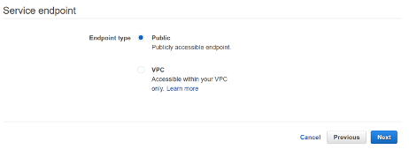

21.	Enter in the **IPv4 Public IP** address you noted previously from the storage_gateway_instance and click **Connect to Gateway**.
22.	Enter a gateway name and click **Activate Gateway**.

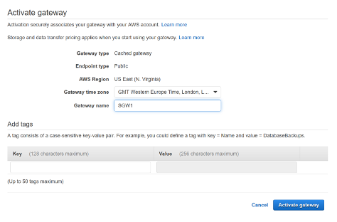

23.	Allocate one disk to **Upload buffer** and one disk to **Cache**, note these down and click **Configure logging**

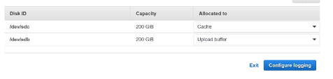

24.	Choose **Create a new log group** and then click **Save and Continue**.
25.	You should now be taken the storage gateway console.

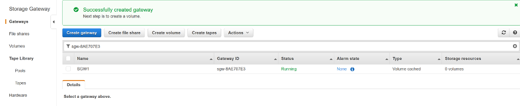

#### 3. Create a Volume on the Volume Storage Gateway

1.	From the **AWS Console**, click **Services**, under **Storage** select **Storage Gateway**.
2.  Select **Volumes**.
3.	Click the **Create volume** button.

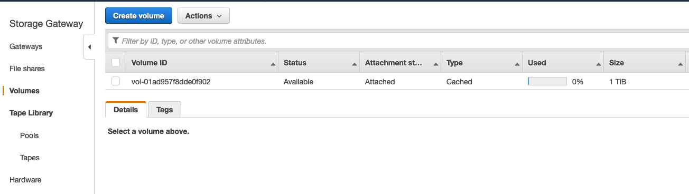

4.	If you have more than on AWS Volume Storage Gateway, be sure to select the correct Gateway from the drop down. Enter the following parameters:
  * Gateway: **< your storage gateway name>**
  * Capacity: **200GB**
  * Volume contents: **New empty volume**
  * iSCSI target name **sgw1**
  * Click **Create volume**

5.	Next configure CHAP authentication with the following parameters:
    * Initiator name: "**Value from final step of module 1**" e.g. iqn.1994-05.com.redhat:7665cb5fc61b
    * Initiator secret: **awsreinvent2020**
    * Target secret: **awsreinforce2020**
    * Click **Save** and then close the window. You can ignore any warnings. 

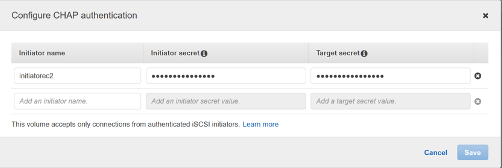

6.	On the left panel click **Volumes** and the volume should now be listed. Note the **Host IP** and **Target name**.

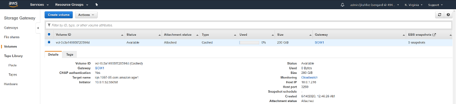

#### 4. Connect to the EC2 Initiator Instances

1.	From the **AWS console**, click **Services** and select **EC2**.
2.	Select **Instances** from the menu on the left.
3.	Right-click on the **EC2 Initiator Instance** and select **Connect** from the menu.
4.	From the dialog box, select the **Session Manager** option, as shown below:

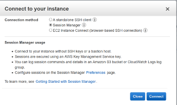

5.	Click **Connect**. A new tab will be opened in your browser with a command line interface (CLI) to the EC2 Initiator Instance.
6.	Use a text editor to uncomment and amend the following lines in **/etc/iscsi/iscsid.conf**.

    sudo nano /etc/iscsi/iscsid.conf

Use the arrow keys to scroll down to the **CHAP Settings** as shown below:

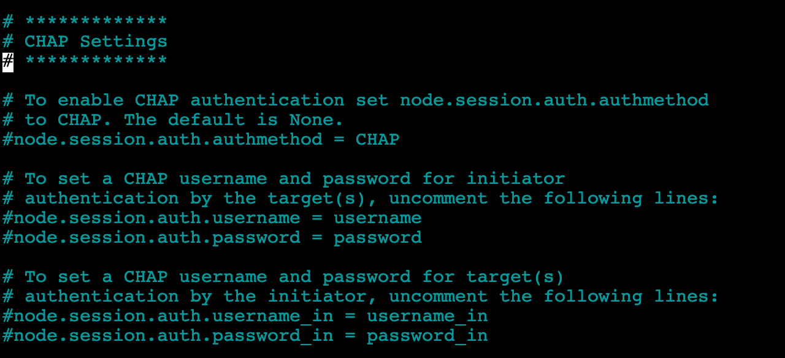

Delete the **#** from the values below and update.

    node.session.auth.authmethod = CHAP

    node.session.auth.username = [initiatorname]

    node.session.auth.password = awsreinvent2020

    node.session.auth.username_in =[Target Name]

    node.session.auth.password_in = awsreinforce2020

You should then have something that looks like this, with your values entered:

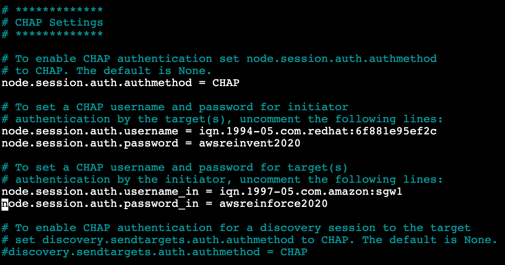

7. **Save and exit** the nano editor.
8. Run the following command on the EC2 Initiator Instance to discover iSCSI volumes on the Volume Storage Gateway replacing **[GATEWAY_IP]** with the **Host IP** we recorded previously:

    sudo /sbin/iscsiadm --mode discovery --type sendtargets --portal [GATEWAY_IP]:3260

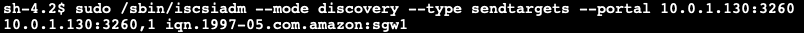

9.	Run the following command on the **EC2 Initiator Instance** to discover iSCSI volumes on the Volume Storage Gateway replacing **[GATEWAY_IP]** with the **Host IP** and **[Target]** with **Target Name** recorded previously:

    sudo /sbin/iscsiadm --mode node --targetname [Target] --portal [GATEWAY_IP]:3260,1 --login

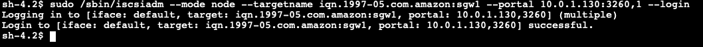

10.	Run the following command on the **EC2 Initiator Instance** to list the attached disks:

    ls -l /dev/disk/by-path

It should show an output similar to this where the iSCSI disk has been mounted to **sda**. Note this down as we will use it in the next module.  

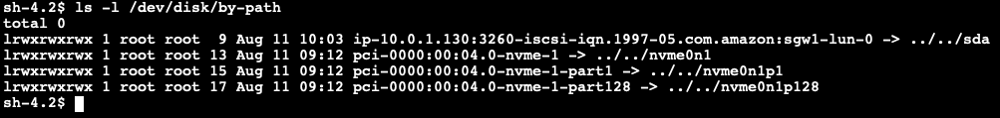

## Module 2 Summary

In this module you have created a Volume Storage Gateway EC2 instance with a cached volume. Then you connected this volume to your EC2 Initiator Instance via iSCSI, using CHAP authentication, making it ready for performance testing.

In the next module you will run performance tests using FIO against this cached volume.  

Go to [Module 3](/module3).
