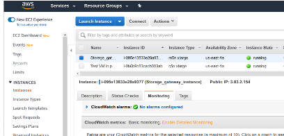
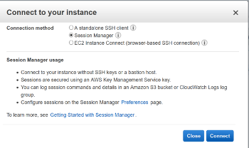
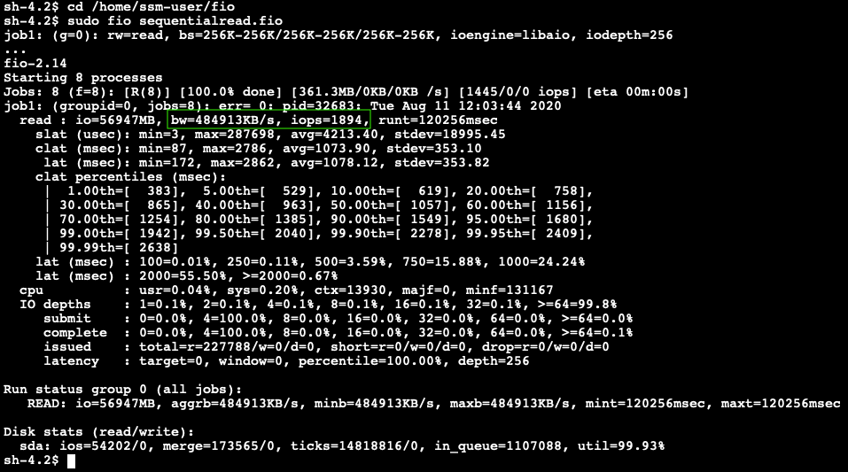
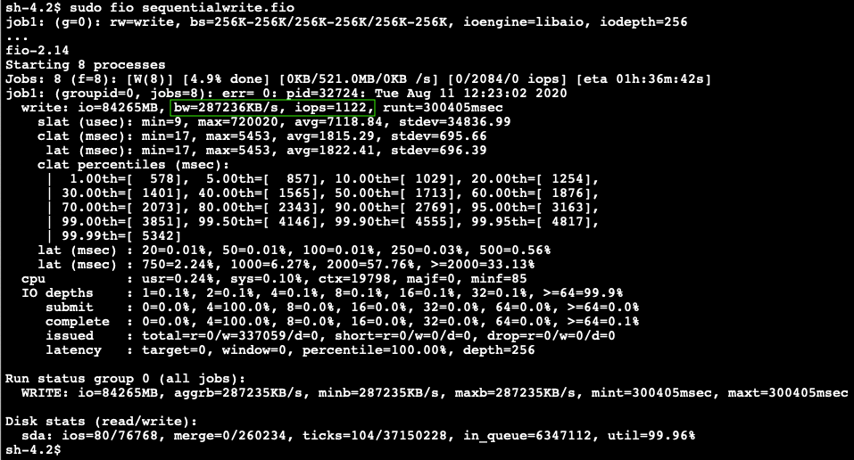
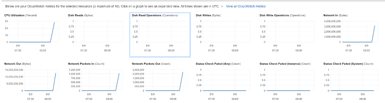
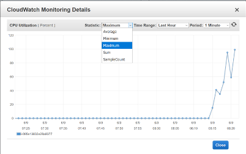
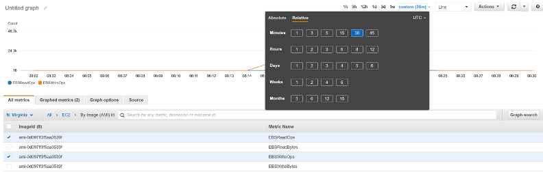
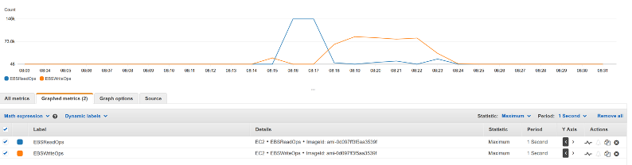

### Workshop Title

© 2020 Amazon Web Services, Inc. and its affiliates. All rights reserved.
This sample code is made available under the MIT-0 license. See the LICENSE file.

Errors or corrections? Contact [ttasker@amazon.co.uk](mailto:ttasker@amazon.co.uk).

---

# Module 3
In this module we will run a number of storage tests with FIO to measure the performance we can expect to see from the Volume Storage Gateway.

## Module Steps

#### 1. Sequential read and sequential write tests

1.	From the **AWS console**, click **Services** and select **EC2**.
2.	Select **Instances** from the menu on the left.
3.	Click on the **Volume Storage Gateway** instance.
4. You can enable Detailed Monitoring either by:

    a. **Right-click** on on the **Volume Storage Gateway** instance and choosing **Manage detailed monitoring** then tick **Enable** and click **Save**

    or

    b. On the bottom panel click **Monitoring** and the click on **Enable detailed monitoring**.

5.	Click **Agree** to the additional charges is asked.
6.	In the top panel then right-click on the **EC2 Initiator Instance** and select **Connect** from the menu.
7.	From the dialog box, select the **Session Manager** option, as shown below:

8.	Click **Connect**. A new tab will be opened in your browser with a command line interface (CLI) to the **EC2 Initiator Instance**.
9.	Run the following command:

    cd /home/ssm-user/fio

10.	Create a **sequentialread.fio** text file.

    nano sequentialread.fio

Copy and paste the parameters below, replacing **[devicename]** with the device from last step of the previous module e.g. **sda**

    [global]
    bs=256K
    iodepth=256
    direct=1
    ioengine=libaio
    group_reporting
    time_based
    runtime=120
    numjobs=8
    name=raw-read
    rw=read

    [job1]
    filename=/dev/<DEVICENAME>

11.	**Save** the file and **exit** the Nano Editor.
12.	Run the following command:

    sudo fio sequentialread.fio

This test will run for 2 minutes and provide a summary similar to below:

Lets take some time to examine these results before we move on. The test was a sequential read using **8 processes** and a **block size of 256K**.  Average throughput was **484913KB/s** or **485MB/s** which is **3.8Gb/sec** and **1894 IOPs at 256K**.  

**Note:** your results will be slightly different but should be comparable. If you find your results are massively outside those seen above, go back and check your .fio file for formatting. It should be identical in number of lines and spacing.  

Before we look at the latency figure we need to consider that although this is a sequential read no data has been written to this volume yet so the cache buffer will be empty. As such all reads will be coming direct from S3, which explains the higher latency figures.  We are not hitting any CPU limits on the Volume Storage Gateway and we will examine these through CloudWatch after the next task.  

13.	Create a **sequentialwrite.fio** text file with the following content:

    nano sequentialwrite.fio

Copy and paste the parameters below, replacing **[devicename]** with the device from last step of the previous module e.g. **sda**

    [global]
    bs=256K
    iodepth=256
    direct=1
    ioengine=libaio
    group_reporting
    time_based
    runtime=300
    numjobs=8
    name=raw-write
    rw=write

    [job1]
    filename=/dev/<DEVICENAME>

14. **Save** the file and **exit** the Nano Editor.
15.	Run the following command:

      sudo fio sequentialwrite.fio

  This test will run for 5 minutes and provide a summary similar to below:

We can see that we are not CPU constrained on the instance, the throughput is nearly half the read test at **287236KB/sec** or **287MB/s**.  We are running this test for 5 minutes as we are going to examine the stats in CloudWatch.

#### 2. Examining CloudWatch Metrics for Volume Storage Gateway

1.	From the **AWS console**, click **Services** and select **EC2**.
2.	Select **Instances** from the menu on the left.
3.	Click on the **Volume Storage Gateway** instance
4.	On the bottom panel click **Monitoring** and you should see the following:

5.	Click on **CPU Utilisation** to display a more in-depth graph.  
6.	Change the statistic to **Maximum**, time range to **Last Hour** and period to **1 minute**.

7.	We can see the first peak of around 30% - 40% CPU is where we completed the read test, the second peak between 90% - 100% is where we did the write test which indicates the write test is CPU constrained.
8.	Click **Close** and then click **View all CloudWatch metrics** at the top of the pane. The EC2 console experience is going through some updates.  You may see the **Manage detailed monitoring** as an alternative.
9.	On the left hand side select **Metrics** then **EC2 -> Per-Instance Metrics** then choose your **Volume Storage Gateway**.
10.	Select **EBS writeops** and **EBS readops** and set to graph to **30 min time range** under **Custom**.

11.	Then choose **Graphed metrics** tab and set statistic to **Maximum** and period to **1 second**.

12.	We can see in the read test a clear peak which has a straight line indicating that the read test is likely disk constrained from the cache disk.  

**Note:** your results may vary. This exercise is to give an idea of how you can monitor your AWS Volume Storage Gateway performance.  

## Module 3 Summary

In this module you have simulated a read and write test using FIO to determine the maximum throughput available on your Volume Storage Gateway.  You have then examined CloudWatch metrics to understand what is constraining this throughput.    

In the next module you will format and write  data to the Volume Storage Gateway volume, then snapshot this and covert it to an EBS volume.  This illustrates how Volume Storage Gateway can be used for migration, disaster recovery or copy data to a development machine in AWS.  

Go to [Module 4](/module4).
