### Workshop Title

© 2020 Amazon Web Services, Inc. and its affiliates. All rights reserved.
This sample code is made available under the MIT-0 license. See the LICENSE file.

Errors or corrections? Contact [ttasker@amazon.co.uk](mailto:ttasker@amazon.co.uk).

---

# Module 4
In this module you will create a file system on the volume, then add some data and snapshot the volume.  You will then clone this snapshot into a new EBS volume and present it directly to an EC2 instance.  

## Module Steps

#### 1. Creating a file system

1.	From the **AWS console**, click **Services** and select **EC2**.
2.	Select **Instances** from the menu on the left.
3.	Right-click on the **EC2 Initiator Instance** and select **Connect** from the menu.
4.	From the dialog box, select the **Session Manager** option, as shown below:

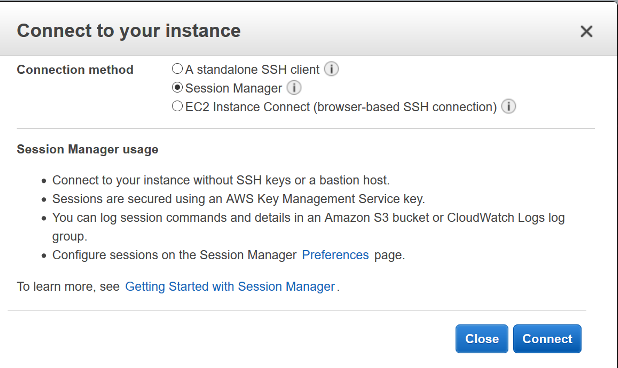

5.	Click **Connect**. A new tab will be opened in your browser with a command line interface (CLI) to the EC2 Initiator Instance.
6.	Run the following command on the EC2 Initiator Instance to list disks attached:

    ls -l /dev/disk/by-path

You should get an output similar to the below where the iSCSI disk has been mounted to **sda**.

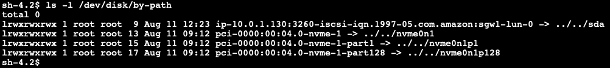

7.	To confirm there is no filesystem already on the disk run the following command, where device name is taken from the previous output.  

    sudo file -s /dev/<devicename>

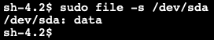

8.	Next we will run a series of commands to create a file system on the disk using **mkfs**.  Starting with the below we can install mkfs:

    sudo yum install xfsprogs -y

9.	Then run the the mkfs command to create the file system. Note this may take a few seconds to complete.  

    sudo mkfs -t xfs /dev/<devicename>

10.	We are then going to mount this new file system under data1.  

    sudo mkdir /data1

    sudo mount /dev/<devicename> /data1
11.	Next we are going to create 5*1GB files, this may take a few minutes:

    for i in {1..5}; do sudo dd if=/dev/urandom bs=1048576  count=1024 of=/data1/file$i; done
12.	This can be confirmed with the following two commands. To see the list of files:

    ls -l /data1

and to see the amount of data used on the disk:

    df -h

#### 2. Creating a snapshot and a volume

1.	We now need to monitor the upload buffer on the Volume Storage Gateway to confirm that all the data has been uploaded before we create a snapshot.  
2.	From the AWS console, click **Services**, under Storage select **Storage Gateway.**
3.	On the left panel click **Gateways** and select your Volume Storage Gateway. The upload buffer will be displayed and it can take up to 5 minutes for this to reach 0% used, you can keep hitting refresh to check.  

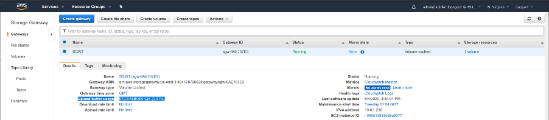

4.	On the left panel click **Volumes** and the select the volume.
5.	Click **Actions**  
6. **Create EBS snapshot**

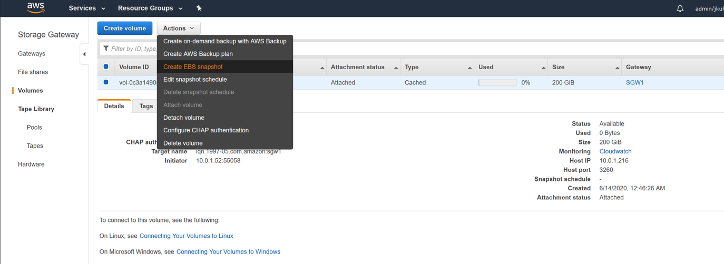

7.	Enter in the description **Clone for EBS Volume** and click **Create EBS Snapshot**.
8.	You should see a green box with a hyperlink to the snapshot, click on the hyperlink **snap-xxxxxxx**.

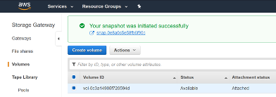

9.	You will now see the progress of your snapshot, note this may take a few minutes to complete, you can hit refresh to check.

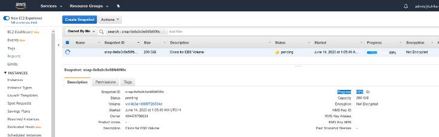

10.	Click **Actions > Create Volume** (note you could also create an image if this was an iSCSI boot disk to create an AMI) and enter the following details:

  - Volume Type **io1**
  - Size **500 GB**
  - IOPS **25,000**

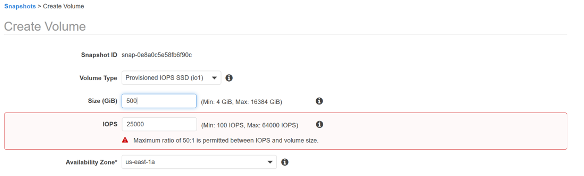

11.	Click **Create Volume**.
12. Click on **Volumes** just above the **Snapshots** option.
13.	Locate and select the volume and click **Actions > Attach Volume**

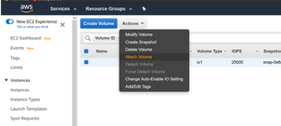

14.	Select the **EC2 Initiator Instance** and it should auto populate the next Device ID, note it down. In this instance it is **/dev/sdg** . Cick **Attach**.  

## 3. Comparing Volume Contents

1.	From the **AWS console**, click **Services** and select **EC2**.
2.	Select **Instances** from the menu on the left.
3.	Right-click on the **EC2 Initiator Instance** and select **Connect** from the menu.
4.	From the dialog box, select the **Session Manager** option, as shown below:

5.	Click **Connect**. A new tab will be opened in your browser with a command line interface (CLI) to the EC2 Initiator Instance.
6.	Run the command:

    lsblk

and note the device of the 500GB volume we have attached. Providing no other EBS volumes have been attached, it will be **nvme[0-26]n1**. We can also see previous 200GB volume as sda, take a note of this.

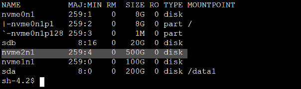

**Note:** The device names that you specify for NVMe EBS volumes in a block device mapping are renamed using NVMe device names (/dev/nvme[0-26]n1). The block device driver can assign NVMe device names in a different order than you specified for the volumes in the block device mapping. For more details on Amazon EC2 Device naming on Linux instances: https://docs.aws.amazon.com/AWSEC2/latest/UserGuide/device_naming.html

7.	We are going to unmount the 200GB Volume Storage Gateway Volume under data1 and mount the 500GB EBS Volume. To start, run the following commands:

    sudo umount /data1

    sudo mount /dev/<devicename> /data1

8.	There should be the 1GB files pre-populated on the volume. This can be confirmed with the following two commands. To see the list of files:

    ls -l /data1

and to check the amount of data used on /dev/[devicename]

    df -h

**Note:** the disk partition has not been expanded on **nvme[0-26]n1** / the snapshot clone volume, so will still show as 200GB in size.  

## 4. Performance tests on the EBS volume

1.	From the **AWS console**, click **Services** and select **EC2**.
2.	Select **Instances** from the menu on the left.
3.	Right-click on the **EC2 Initiator Instance** and select **Connect** from the menu.
4.	From the dialog box, select the **Session Manager** option, as shown below:

5.	Click **Connect**. A new tab will be opened in your browser with a command line interface (CLI) to the EC2 Initiator Instance.
6.	Run the command:

    cd /home/ssm-user/fio

7.	Edit the **sequentialread.fio** text file:

    nano sequentialread.fio

replace **< devicename>** with the 500GB EBS volume from the previous module e.g. nvme1n1

    filename=/dev/<devicename>

**Save** and **exit** the nano editor.  

8.	Run the following command:

    sudo fio sequentialread.fio

this test will run for 2 minutes and provide a summary similar to below.

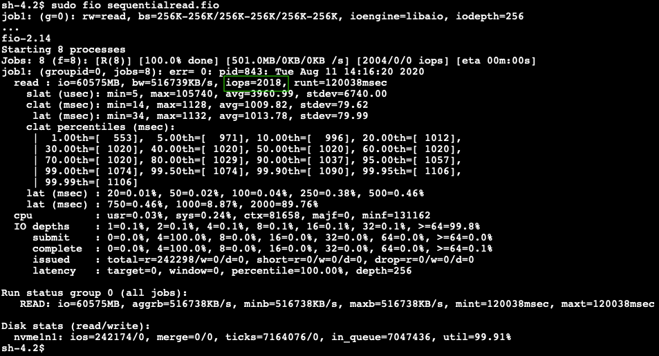

9.	We get an unexpected result of around **2000 IOPs**. This is due to us hitting the bandwidth limit of the c5 instance https://docs.aws.amazon.com/AWSEC2/latest/UserGuide/ebs-optimized.html.
To prove this we are going to change the block size. Edit the sequentialread.fio text file as follows:

     nano sequentialread.fio

and replace **bs=256K** with **bs=16K**

    bs=16K

10.	**Save and exit** and then run the following command:

    sudo fio sequentialread.fio

this test will run for 2 minutes and provide a summary similar to below

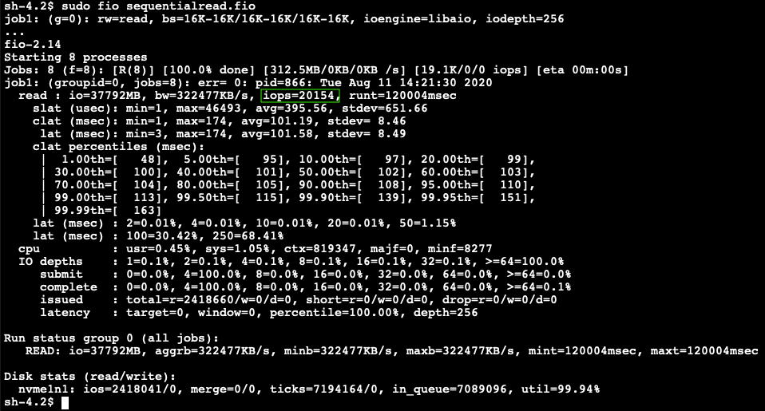

11.	We hit **20,000 IOPs** due to the limit of the c5 instance type https://docs.aws.amazon.com/AWSEC2/latest/UserGuide/ebs-optimized.html
12.	To prove this we are going to change the EC2 instance type. Navigate to the **EC2 console**.
13.	Select **Instances** from the menu on the left.
14.	In the top panel, right-click on the **EC2 Initiator Instance** and select **Instance State -> Stop** from the menu.

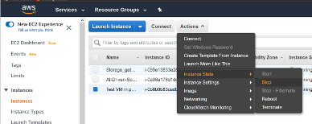

15.	Wait for the instance to stop, and then right-click on the **EC2 Initiator Instance** and select **Instance Settings -> Change Instance Type** from the menu.

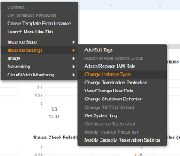

16.	Select **c5n.9xlarge** and click **Apply**.
17.	Right-click on the **EC2 Initiator Instance** and select **Instance State -> Start** from the menu.
18.	Wait for the instance to start.
19.	In the top panel then right-click on the **EC2 Initiator Instance** and select **Connect** from the menu.
20.	From the dialog box, select the **Session Manager** option, as shown below:

21.	Click **Connect**. A new tab will be opened in your browser with a command line interface (CLI) to the **EC2 Initiator Instance**.
22.	Run the following command:

    sudo fio /home/ssm-user/fio/sequentialread.fio

this test will run for 2 minutes and provide a summary similar to below

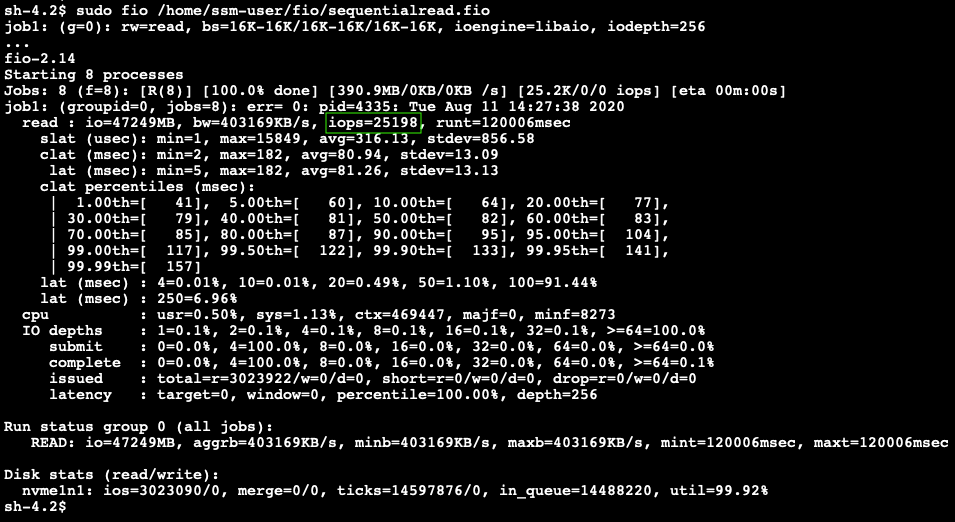

23.	We can see we now reach 25,000 IOPs which was the limit we set on the volume (Section 2, step 10.)

## Module 4 Summary

In this module you have created an EBS volume from a snapshot of the Volume Storage Gateway volume. This can be useful for migration, testing or even disaster recovery. You then continued to run performance tests on the EBS volume and understand the limits imposed by both the instance type and the volume.  

Now all that's left is to tidy up the environment in Module 5.

Go to [Module 5](/module5).
